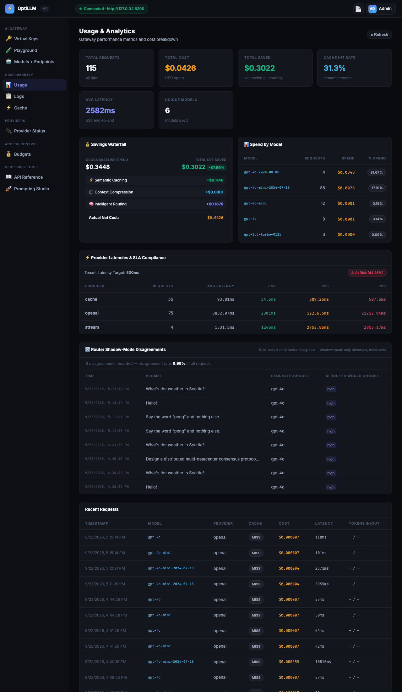
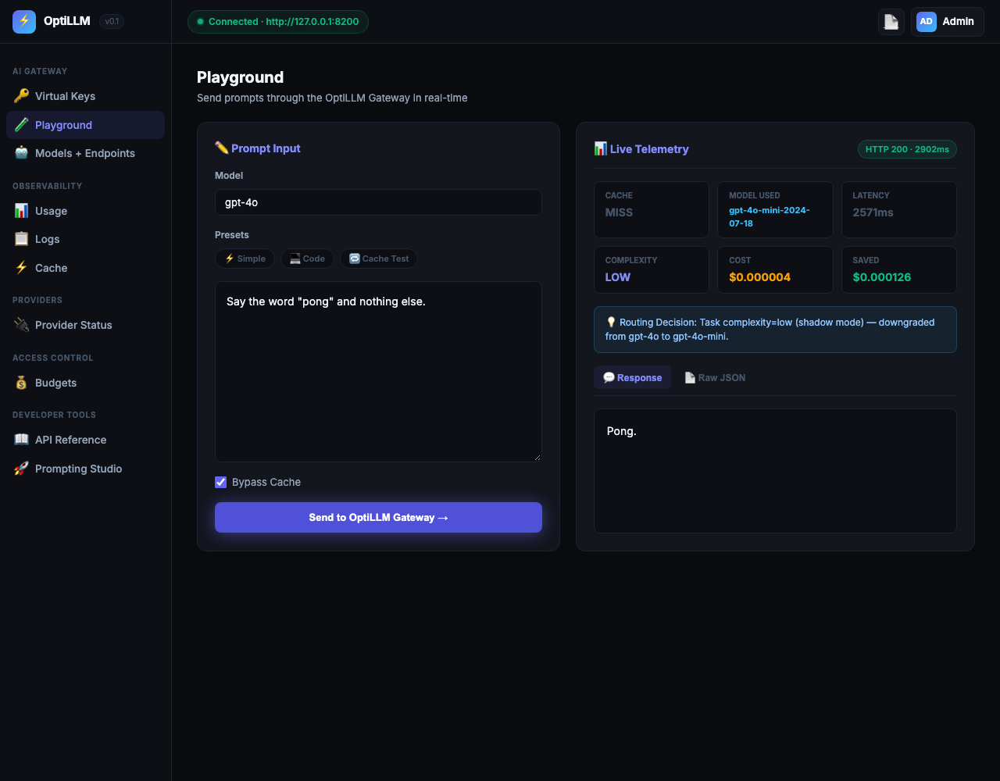

# OptiLLM ⚡
### Enterprise AI Gateway with Semantic Caching, Intelligent Routing & Online Learning

[](https://www.python.org/downloads/)
[](https://fastapi.tiangolo.com)
[](https://opensource.org/licenses/MIT)
[]()
[-yellow.svg)]()
[](docs/benchmarks.md)

OptiLLM is a high-performance, drop-in replacement for OpenAI API endpoints designed to cut LLM spend by an estimated **40% to 80%** without sacrificing output quality (target based on local benchmarks — live-traffic validation in progress, see [docs/benchmarks.md](docs/benchmarks.md)).

It sits transparently between your applications and LLM providers (OpenAI, Anthropic, Gemini, Groq, Mistral, Azure, Bedrock, and Ollama), executing a 4-tier optimization pipeline: **Semantic Caching**, **Smart Context Compression**, **Intelligent Complexity-Aware Routing**, and an **Online Learning Feedback Loop**.

---

## 🌟 Why OptiLLM? (Feature Comparison)

| Capability | OptiLLM | LiteLLM | Portkey | Direct Provider |
|---|:---:|:---:|:---:|:---:|
| **Drop-in OpenAI SDK Compatibility** | ✅ Yes | ✅ Yes | ✅ Yes | ❌ Native Only |
| **Semantic Vector Cache (FAISS + Redis)** | ✅ Built-in | ⚠️ Plugin only | ✅ Yes | ❌ None |
| **Self-Learning Router (Continuous Retraining)** | ✅ **Yes (Unique)** — [validated](docs/routing.md#4-does-it-actually-work-real-validation-results) | ❌ Static Rules | ❌ Static Rules | ❌ None |
| **TF-IDF Informational Context Compression** | ✅ **Yes (Unique)** | ❌ None | ❌ None | ❌ None |
| **Quality-Attributed Cost Analytics** | ✅ **Yes (Unique)** | ❌ Spend only | ❌ Spend only | ❌ None |
| **Dual-Mode LLM-as-Judge Evaluation** | ✅ Built-in | ❌ None | ⚠️ Add-on | ❌ None |
| **Per-Request User Feedback Loop** | ✅ Built-in | ❌ None | ⚠️ Add-on | ❌ None |
| **K8s Structured Health & Readiness Probes** | ✅ Yes (`/health/ready`) | ⚠️ Basic | ⚠️ Basic | ❌ None |
| **Provider Fallback & Circuit Breaker** | ✅ Sub-second | ✅ Yes | ✅ Yes | ❌ None |
| **Sync & Async Python SDK + CLI** | ✅ Native | ⚠️ CLI only | ✅ Yes | ❌ Provider only |

---

## 🏗️ Architecture Pipeline

```
Incoming Request (OpenAI SDK / HTTP)
       │
       ▼
[0. Security & Protection Middleware]
   ├── API Key Auth & Scopes
   ├── Token Bucket Rate Limiting (RPM / TPM)
   └── Request Size Limits (1MB cap, 200 msg cap)
       │
       ▼
[1. Semantic Cache Lookup]
   ├── Embedding: all-MiniLM-L6-v2 (384d)
   ├── Tier 1: Redis Vector Search
   └── Tier 2: FAISS Exact Inner-Product Search
       ├── HIT (Score ≥ 0.90) ──────────────┐
       └── MISS                             │
            │                               │
            ▼                               │
[2. Context Compression]                    │
   ├── Pass 1: Whitespace & Deduplication  │
   └── Pass 2: Smart TF-IDF Sentence Rank   │
            │                               │
            ▼                               │
[3. Intelligent Model Routing]              │
   ├── Complexity Classifier                │
   │    ├── Low  → gpt-4o-mini / gemini     │
   │    ├── Med  → claude-3-5-haiku / mistral│
   │    └── High → gpt-4o / claude-3-5-sonnet│
   └── Shadow Disagreement Logging          │
            │                               │
            ▼                               │
[4. Provider Dispatch & Resilience]         │
   ├── Circuit Breakers per Provider        │
   ├── Automatic Retry & Multi-Provider Fallback
   └── Per-Provider Latency Timeouts        │
            │                               │
            ▼                               │
[5. Post-Execution & Learning Loop]         │
   ├── Cache Insertion (FAISS + Redis)      │
   ├── Token Count & Exact Cost Attribution │
   ├── Quality Judge (Heuristic + 5% LLM)   │
   └── Feedback API (Triggers Retrain Loop) │
            │                               │
            ▼                               │
     Returned Response ◄────────────────────┘
```

---

## ⚡ 5-Minute Quickstart

### 1. Installation

```bash
# Clone repository
git clone https://github.com/Sarthakkad05/OptiLLM.git
cd OptiLLM

# Create virtual environment
python3 -m venv venv
source venv/bin/activate

# Install dependencies
pip install -r requirements.txt
```

### 2. Configure Environment

```bash
# Copy example configuration
cp .env.example .env

# Edit .env and set your API keys (e.g. OPENAI_API_KEY)
# If no keys are set, OptiLLM automatically operates in local mock mode for development!
```

### 3. Launch the Gateway

```bash
python -m uvicorn app.main:app --host 0.0.0.0 --port 8000 --reload
```

Verify the gateway is live:
```bash
curl http://localhost:8000/health
# Returns: {"status":"ok","service":"optillm-gateway","version":"1.0.0","database":"connected","uptime_seconds":1.2}
```

### 4. Or run the full HA stack with Docker Compose

Two gateway replicas behind an nginx load balancer, sharing PostgreSQL and Redis, with Prometheus and Grafana:

```bash
cp .env.example .env
docker compose up -d --build --scale optillm=2
curl http://localhost:8000/health        # via nginx, round-robin across replicas
```

Grafana is at `http://localhost:3000` (provisioned OptiLLM dashboard). Migrations run automatically on startup and are safe when several replicas boot at once. See the [Production Deployment Guide](docs/deployment.md) for scaling, schema recovery, and validated load-test results.

---

## 💻 Usage

### 1. Drop-in Replacement for OpenAI SDK

Just point `base_url` to `http://localhost:8000/v1`:

```python
from openai import OpenAI

# Standard OpenAI client pointing to OptiLLM
client = OpenAI(
    base_url="http://localhost:8000/v1",
    api_key="sk-optillm-dev-key",  # or your OptiLLM key
)

response = client.chat.completions.create(
    model="gpt-4o",
    messages=[{"role": "user", "content": "Explain quantum computing simply."}],
)

print(response.choices[0].message.content)
```

### 2. Using the Native OptiLLM Python SDK

```python
from optillm_client import OptiLLMClient

client = OptiLLMClient(base_url="http://localhost:8000", api_key="sk-optillm-dev-key")

# 1. Chat Completion with OptiLLM features
response = client.chat.completions.create(
    model="gpt-4o",
    messages=[{"role": "user", "content": "What is binary search?"}],
    bypass_cache=False,
    tag="production-chatbot",
)
print("Answer:", response.content)
print("Metadata:", response.optillm_metadata)

# 2. Inspect Quality vs Cost Tradeoffs
tradeoff = client.analytics.quality_cost_tradeoff()
print("Recommendation:", tradeoff["recommendation"])

# 3. Submit User Feedback (feeder for online learning loop)
client.feedback.submit(
    request_id=response.id,
    rating=1,
    notes="Fast and accurate reply",
)
```

### 3. Native Async Python SDK

```python
import asyncio
from optillm_client import AsyncOptiLLMClient

async def main():
    async with AsyncOptiLLMClient(base_url="http://localhost:8000") as client:
        response = await client.chat.completions.create(
            model="gpt-4o",
            messages=[{"role": "user", "content": "Summarize clean architecture."}],
        )
        print(response.content)

asyncio.run(main())
```

### 4. OptiLLM CLI Tool

```bash
# Check status and provider health
python -m optillm_client.cli status

# Send a prompt through the pipeline
python -m optillm_client.cli chat "What is Shor's algorithm?" --model gpt-4o

# Inspect routing decision for a query
python -m optillm_client.cli explain "Implement a red-black tree in Rust"

# View real-time analytics
python -m optillm_client.cli analytics --days 7

# Inspect and manage semantic cache
python -m optillm_client.cli cache info
python -m optillm_client.cli cache clear
```

---

## 🖥️ Admin Dashboard

A single-file, zero-build admin UI (`app/static/admin.html`, served at `/admin`) for managing keys, watching live analytics, and testing prompts — no separate frontend deploy required.

**Usage & Analytics** — cost/savings breakdown, provider latency & SLA compliance, and router shadow-mode disagreements (see [docs/routing.md](docs/routing.md)) in one view:



**Playground** — send a prompt through the real pipeline and see the routing decision, cache status, and cost/savings live:



Every panel shown above is wired to a real endpoint and was verified against a running instance with zero console errors (see the dashboard QA pass referenced in the project history) — not mockups.

---

## 📊 Benchmark Results

> ⚠️ **Status: local/synthetic overhead numbers below, plus an initial live-traffic pass and a multi-replica concurrency test.** The table's overhead numbers come from `benchmarks/generate_report.py` (in-memory FAISS/SQLite, no real provider traffic). A separate live-traffic validation against real OpenAI calls with real LLM-judge scoring exists in [`benchmarks/LIVE_BENCHMARK_REPORT.md`](benchmarks/LIVE_BENCHMARK_REPORT.md) — it's OpenAI-only and small-sample so far, but it already surfaced a real rule-based router misclassification on a genuinely complex prompt. Concurrency was validated separately (see below). Cross-provider live validation is still open — see [docs/benchmarks.md](docs/benchmarks.md).

| Optimization Layer | Metric | Result (local, single-process) |
|---|---|:---:|
| **Semantic Cache** | Exact Cache Hit Latency | **8.36 ms** |
| **Semantic Cache** | Paraphrased Hit Rate (@ 0.85 threshold) | **100.0 %** *(synthetic paraphrase set)* |
| **Intelligent Router** | Decision Overhead (P50) | **1.60 ms** |
| **Intelligent Router** | Cost-Optimized Down-routing | **100.0 %** *(synthetic prompt set)* |
| **Context Compression** | Smart (TF-IDF) Token Reduction | **68.8 %** |
| **Context Compression** | Processing Latency | **5.56 ms** |

**Concurrency / high availability** (2 replicas + nginx + shared Postgres/Redis, mock provider mode, Docker Desktop on an 8-CPU laptop): 3,300 requests at up to 100 concurrent — **0 failures**, load split ~50/50 across replicas, DB row counts exact (nothing dropped or double-counted), ~25 req/s sustained. This measures gateway/DB overhead, not provider latency. Details and methodology: [Production Deployment Guide](docs/deployment.md#ha-validation-results).

> 📖 See full methodology, caveats, and validation status in [docs/benchmarks.md](docs/benchmarks.md).  
> *Run benchmarks yourself:* `python benchmarks/generate_report.py` or `make bench` (local/synthetic); `python benchmarks/bench_live.py` for the live-traffic pass (requires a real `OPENAI_API_KEY`, makes real billed calls, costs a few cents per run); `python benchmarks/bench_concurrency.py` against a running compose stack for the concurrency test (see the deployment guide).

---

## 📚 Documentation Index

- [Quickstart Guide](docs/quickstart.md) — 5-minute setup and configuration walkthrough.
- [Public Benchmarks](docs/benchmarks.md) — Detailed latency, compression, and cost-waterfall analysis.
- [Intelligent Routing & Online Learning](docs/routing.md) — Complexity assessment, shadow mode, and automatic retraining.
- [Semantic Caching Guide](docs/caching.md) — Cosine similarity threshold tuning, TTLs, and multi-tenant namespaces.
- [Plugins Architecture](docs/plugins.md) — Writing custom lifecycle hooks, webhooks, and alerts.
- [Evaluation & Quality Analytics](docs/evaluation.md) — Dual-mode judge, quality-cost tradeoffs, and user feedback loop.
- [Production Deployment Guide](docs/deployment.md) — HA Docker Compose stack, migrations, validated load-test results, Kubernetes probes, and production checklist.
- [Interview Q&A](docs/interview_questions.md) — 50+ deep-dive questions and answers covering every subsystem, design decision, and bug discovered during development.
- [Technical Deep-Dive Notes](docs/technical_notes.md) — In-depth notes on semantic caching, FAISS index types, embedding model choice, TF-IDF compression, cost estimation, schema design, and known limitations.

---

## 🧪 Testing

OptiLLM maintains high test coverage across all subsystems:

```bash
# Run complete test suite (166 tests)
pytest tests/ -v

# Run integration tests only
pytest tests/integration/ -v

# Run degraded mode & resilience tests
pytest tests/integration/test_degraded_mode.py -v
```

---

## 📄 License

MIT License.
