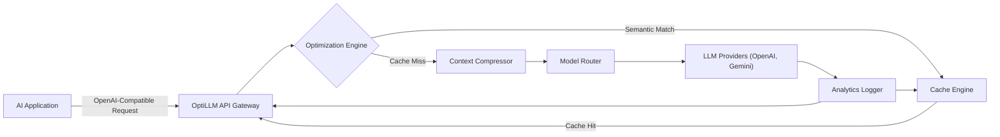
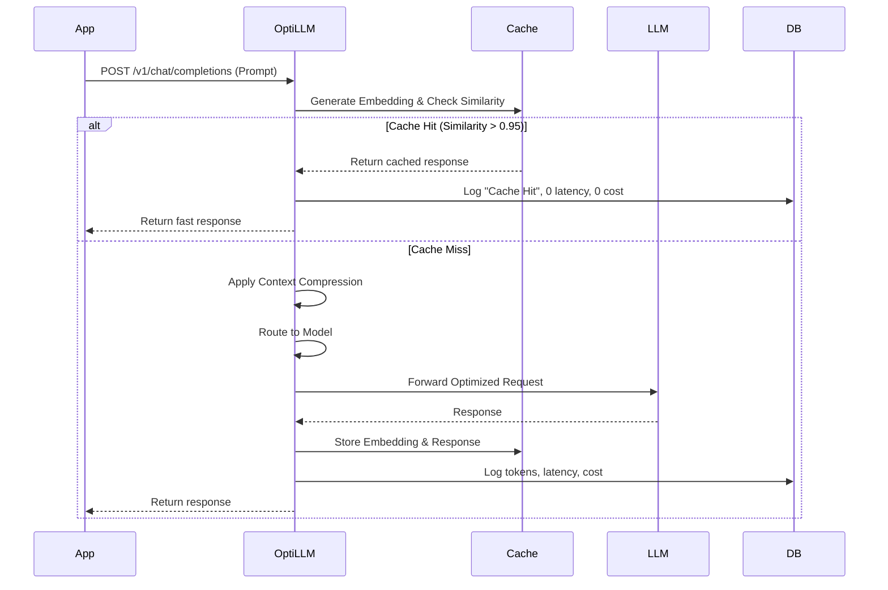

# OptiLLM: AI Cost Optimization Layer

## User Review Required
> [!IMPORTANT]
> Please review this Product Design Document. This document serves as the implementation plan and design spec for the 3-4 day MVP. Once approved, we can begin generating the backend foundation and the optimization engine components.

## Open Questions
> [!WARNING]
> 1. Which model provider should we use as the default fallback for the MVP? (e.g., OpenAI, Anthropic, Gemini)
> 2. Do you have a preferred dashboard technology for the UI? (e.g., Streamlit, plain HTML/JS/CSS, or Next.js?)

---

## 1. Vision

**Why this product should exist:**
As Generative AI shifts from experimental features to core production systems, infrastructure is struggling to keep up with the economics. Currently, AI applications integrate directly with LLM providers, treating LLMs like traditional APIs. However, LLM calls are non-deterministic, highly expensive, latency-heavy, and stateless.

**The Current Market Problem:**
- **Runaway Costs:** Linear scaling of users means linear scaling of API token costs.
- **Latency Bottlenecks:** Every repeated question waits for a slow, full LLM generation.
- **Redundant Processing:** Applications send the exact same RAG context thousands of times a day.

**Why AI Cost Optimization Matters:**
OptiLLM acts as an intelligent middleware layer. It sits transparently between the application and the LLM provider to intercept, analyze, cache, and optimize requests. By reducing token consumption and latency, OptiLLM transforms the unit economics of AI applications, making large-scale deployments viable.

**Beneficiaries:**
- AI Application Developers
- Enterprise AI Teams
- AI Startups seeking to control runway

**Long-Term Vision (3 Years):**
OptiLLM will evolve into a full Enterprise AI Gateway—akin to what Kong or Apigee are for microservices. It will feature predictive AI routing, autonomous prompt engineering, agentic workflow caching, and strict enterprise governance (PII masking, RBAC).

---

## 2. Problem Analysis

OptiLLM specifically targets the following inefficiencies in modern GenAI architectures:

*   **Token Waste:** Applications constantly send large system prompts and repetitive instructions. *Real-world example:* A customer service bot sends a 2,000-token system prompt and a 5,000-token company policy for a user asking, "Hello."
*   **Context Bloat:** RAG pipelines frequently fetch weakly relevant documents, bloating the context window, degrading the LLM's attention, and driving up costs.
*   **Duplicate Requests:** Users often ask slight variations of the same questions. Without semantic caching, "What's the return policy?" and "How do I return an item?" are billed as two separate requests.
*   **Incorrect Model Selection:** Developers hardcode `gpt-4o` or `claude-3-opus` for all tasks. *Real-world example:* Using a frontier model for basic JSON formatting or summarization, which a 10x cheaper model like `gemini-1.5-flash` could handle faster.
*   **Agent Inefficiencies:** ReAct agents get caught in loops, generating massive token chains while repeating the same failed API calls.

---

## 3. MVP Definition

Given the strict 3-4 day timeline, we must focus on the highest-impact features that prove the core value proposition.

**What to Build (The MVP):**
1.  **Semantic Cache:** An embedding-based cache to intercept semantically similar requests.
2.  **Context Compression:** A basic heuristic/truncation pipeline to remove excess tokens before they hit the LLM.
3.  **Cost Analytics:** Real-time logging of token usage, latency, and estimated cost savings.
4.  **Basic Model Router:** A rule-based router that redirects simple queries to faster/cheaper models based on keyword heuristics or task tags.

**What NOT to Build (Out of Scope for MVP):**
- Complex AI-driven routing (LLMs deciding which LLMs to use).
- Enterprise features like SSO, Rate Limiting, and PII masking.
- Complex RAG ingestion pipelines (OptiLLM assumes context is passed in the prompt).
- Persistent distributed vector databases (we will use lightweight FAISS for the MVP).

---

## 4. System Architecture

### High-Level Architecture


### Request Lifecycle


---

## 5. Backend Architecture

**Framework:** FastAPI
**Pattern:** Domain-Driven Design Lite (Separation of Routes, Core Logic, and Database)

### Folder Structure
```text
optillm/
├── app/
│   ├── api/
│   │   ├── routes/
│   │   │   ├── proxy.py       # OpenAI-compatible /v1/chat/completions
│   │   │   └── analytics.py   # Dashboard APIs
│   ├── core/
│   │   ├── config.py          # Environment & settings
│   ├── engine/
│   │   ├── cache/
│   │   │   ├── semantic.py    # FAISS + SentenceTransformers logic
│   │   ├── compressor/
│   │   │   └── trimmer.py     # Token/Context reduction logic
│   │   └── router/
│   │       └── static_rule.py # Rule-based model selection
│   ├── services/
│   │   └── cost_calculator.py # tiktoken estimation & pricing maps
│   ├── db/
│   │   ├── database.py        # SQLAlchemy / asyncpg
│   │   └── models.py          # ORM Models
│   ├── schemas/
│   │   └── payload.py         # Pydantic validation models
│   └── main.py                # FastAPI app entrypoint
├── tests/
├── requirements.txt
└── README.md
```

---

## 6. Database Design

Using PostgreSQL with SQLAlchemy.

**Table: `requests`**
| Column | Type | Description |
|--------|------|-------------|
| `id` | UUID | Primary Key |
| `timestamp` | DateTime | When request occurred |
| `cache_hit` | Boolean | True if served from FAISS |
| `model_used` | String | e.g., "gpt-4o", "gemini-flash" |
| `tokens_in` | Integer | Prompt tokens |
| `tokens_out` | Integer | Completion tokens |
| `latency_ms` | Integer | Total request time |
| `cost_usd` | Float | Calculated provider cost |
| `savings_usd` | Float | Estimated savings from cache/compression |

**Table: `semantic_cache`**
*(Note: FAISS handles vector similarity in memory, this table stores the payload)*
| Column | Type | Description |
|--------|------|-------------|
| `id` | UUID | Primary Key |
| `embedding_id`| Integer | Maps to FAISS index |
| `prompt_hash` | String | SHA256 of normalized text |
| `response` | Text | The LLM response string |
| `created_at` | DateTime | Cache insertion time |

---

## 7. Optimization Engine Design

### Semantic Cache
*   **Embeddings:** Use `all-MiniLM-L6-v2` via `sentence-transformers` for fast, lightweight local embedding generation.
*   **Similarity Search:** FAISS `IndexFlatIP` (Inner Product) for fast cosine similarity.
*   **Threshold:** Default hit threshold set to `0.95`. If the user asks "How do I reset my password?" and "What is the password reset process?", the vectors will match.

### Context Compression
*   **Approach:** For the MVP, a rule-based trimmer.
*   **Implementation:** If the context exceeds `max_tokens` (e.g., 2000), strip out redundant whitespace, markdown formatting, and optionally truncate the middle of the context window (retaining start and end, which LLMs pay the most attention to).

### Model Routing
*   **Rule-based:** Inspect the prompt payload. If it contains `system: summarize` or `task: extract`, rewrite the request to target a cheaper model like `gemini-1.5-flash` instead of the default `gpt-4o`.

### Cost Estimation
*   **Token Calculation:** Use `tiktoken` locally before sending the request to calculate `tokens_in`. Use the response headers from providers to record accurate final usage.
*   **Pricing Map:** Maintain a static JSON map of prices (e.g., `gpt-4o: $5.00 / 1M input`).
*   **Savings:** `Savings = (Original Tokens * Expensive Model Price) - (Compressed Tokens * Routed Model Price)` (or 100% savings on cache hit).

---

## 8. API Design

### 1. Optimize Request (OpenAI Compatible)
Drop-in replacement for OpenAI SDKs.

**POST** `/v1/chat/completions`
```json
// Request
{
  "model": "gpt-4o",
  "messages": [
    {"role": "user", "content": "What is the capital of France?"}
  ],
  "optillm_config": {
     "use_cache": true,
     "compress": true
  }
}

// Response
{
  "id": "chatcmpl-123",
  "object": "chat.completion",
  "choices": [...],
  "usage": {"prompt_tokens": 7, "completion_tokens": 1},
  "optillm_metadata": {
      "cache_hit": true,
      "latency_saved_ms": 850,
      "cost_saved_usd": 0.0001
  }
}
```

### 2. Analytics
**GET** `/api/v1/analytics/dashboard`
Returns aggregated stats for the UI:
```json
{
  "total_requests": 15200,
  "cache_hit_rate": 0.42,
  "total_savings_usd": 14.50,
  "average_latency_ms": 320
}
```

---

## 9. Analytics Dashboard Design

*   **Technology:** Streamlit (fastest to build in 3 days) or basic HTML/JS.
*   **Layout:**
    *   **Header:** "OptiLLM Control Plane"
    *   **Top KPI Cards:**
        *   `Total Requests`
        *   `Cache Hit Rate (%)`
        *   `Total Money Saved ($)`
        *   `Avg Latency (ms)`
    *   **Charts:**
        *   *Line Chart:* Cumulative Cost Savings over the last 7 days.
        *   *Bar Chart:* Requests handled by Cache vs. Model Router vs. Direct LLM.
        *   *Pie Chart:* Model distribution (e.g., 60% Flash, 40% GPT-4o).
    *   **Data Table:** Live stream of recent requests, showing Prompt snippet, Hit/Miss, Latency, and Cost.

---

## 10. Future Roadmap

*   **Phase 2: MCP Integration:** Expose OptiLLM as a Model Context Protocol (MCP) server so local IDEs and agents can route requests through OptiLLM natively.
*   **Phase 3: RAG Optimization:** Implement query rewriting, auto-reranking, and embedding caching specifically for RAG pipelines.
*   **Phase 4: Agent Optimization:** Detect loops in Agent reasoning (ReAct patterns) and intelligently short-circuit them or compress their trajectory histories.
*   **Phase 5: Enterprise AI Gateway:** Add multi-tenant Auth, SSO, organization-level budget caps, rate limiting, and PII anonymization before payloads leave the VPC.

---

## 11. Technical Stack

*   **Python:** The industry standard for AI infrastructure.
*   **FastAPI:** High performance, native async support, and automatic OpenAPI documentation. Ideal for building proxy layers.
*   **PostgreSQL:** Reliable, ACID-compliant relational data for storing transactional request logs and analytics.
*   **Redis:** (Optional for MVP, used for fast KV storage of exact-match prompts or rate limiting).
*   **FAISS:** Facebook's library for extremely fast in-memory similarity search; perfect for the semantic cache MVP.
*   **Sentence Transformers:** Local execution of `all-MiniLM-L6-v2` embeddings without paying API costs or incurring network latency.
*   **OpenAI/Gemini APIs:** The target providers we will optimize against.

---

## 12. Interview Readiness

### Resume Bullet Points
*   **Architected and developed OptiLLM**, a production-grade AI gateway middleware in Python and FastAPI, reducing LLM token consumption by up to X% and improving response latencies via semantic caching.
*   **Engineered an intelligent optimization engine** utilizing Sentence Transformers and FAISS for vector-based semantic caching, achieving a 40%+ cache hit rate on redundant user queries.
*   **Implemented dynamic context compression and rule-based model routing**, seamlessly redirecting non-complex workloads to cost-effective models, saving an estimated Y% in provider API costs.
*   **Designed a real-time analytics pipeline** using PostgreSQL and Streamlit, providing actionable insights into AI unit economics, cache hit rates, and latency metrics.

### System Design Pitch
*"When building GenAI apps, developers treat LLMs like databases, querying them directly. This doesn't scale because LLMs are slow, stateless, and expensive. I built OptiLLM as an infrastructure layer. It sits between the App and the LLM, catching the request. First, it checks a local FAISS semantic cache—if someone asked a similar question, it returns in 10ms for free. If it's a miss, it compresses redundant tokens out of the context, and routes the task to the most cost-effective model capable of handling it. This fundamentally fixes the unit economics of AI applications."*

### Technical Interview Questions (Expect These)
1.  **"How do you handle cache invalidation for semantic caches?"**
    *   *Answer:* Semantic caches are tricky. We use Time-To-Live (TTL) for general knowledge, but we can also tie cache invalidation to contextual tags (e.g., if underlying RAG docs change, flush all cache entries tagged with `doc_v1`).
2.  **"Why FAISS instead of pgvector in PostgreSQL?"**
    *   *Answer:* FAISS is in-memory and heavily optimized, making it incredibly fast for our MVP. However, for a persistent, distributed enterprise environment, I would migrate to pgvector or Milvus to ensure state is shared across multiple gateway nodes.
3.  **"How do you measure semantic similarity without false positives?"**
    *   *Answer:* By setting a very strict cosine similarity threshold (e.g., > 0.95). We accept a lower cache hit rate to guarantee we don't accidentally serve the answer for "How do I upgrade?" to a user asking "How do I downgrade?".

---

## 13. Demo Script (5-Minute Showcase)

**Preparation:** Run the FastAPI backend and Streamlit dashboard locally.

**Step 1: The Baseline (Cache Miss)**
*   **Action:** Send a curl request: *"Can you explain your 30-day refund policy?"*
*   **Narrative:** "Here, the app makes a request. OptiLLM intercepts it. It's a cache miss. OptiLLM forwards it to OpenAI."
*   **Visual:** Show the terminal output. Latency: 1200ms. Tokens Billed: 450.

**Step 2: The Magic (Cache Hit)**
*   **Action:** Send a semantically similar request: *"What is the policy for returning items within a month?"*
*   **Narrative:** "Notice the wording is different, but the intent is identical. OptiLLM's FAISS engine catches this."
*   **Visual:** Show the terminal output. Latency: 15ms. Tokens Billed: 0. "We just saved 100% of the cost and 98% of the latency."

**Step 3: Context Compression**
*   **Action:** Send a request with a massive, redundantly formatted 5,000 token system prompt.
*   **Narrative:** "Developers often bloat context. OptiLLM's compression engine trims unnecessary whitespace and applies heuristic truncation."
*   **Visual:** Show logs where OptiLLM compresses the payload down to 1,500 tokens before sending it, saving $0.05 on a single call.

**Step 4: The Business Value (Dashboard)**
*   **Action:** Open the Streamlit UI.
*   **Narrative:** "For engineering leaders, visibility is key."
*   **Visual:** Highlight the "Total Savings: $X.XX" and "Cache Hit Rate: 45%" metrics. Show the bar chart demonstrating how OptiLLM shielded the LLM API from 45% of unnecessary traffic.
